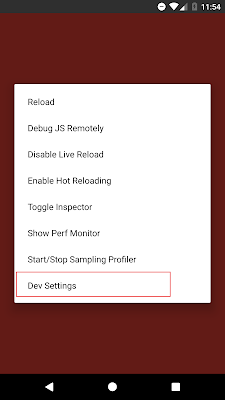
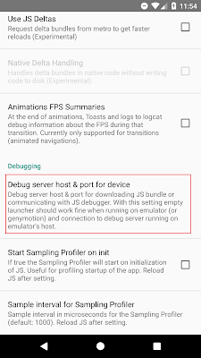
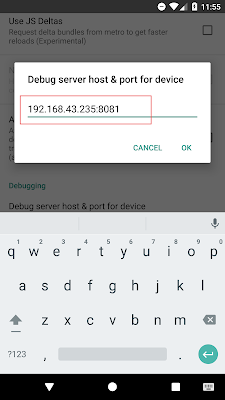

## Network request failed
Эта ошибка из за того что устройство не может послать запрос, так как не может перебороть промежуточный ПК. 
Решить эту проблему можно подключив устройство через Wi-Fi.
И указать **Debug server** в устройстве

> Адресс **Debug server** пишет при запуске `react-native start`

**Step 1.** Open installed react native app on your real android device and shake your android device little bit to open in-app developer menu and select Dev Settings option as shown below.

**Step 2.** Under Debugging section select Debug server host & port for device option.

**Step 3.** Вписываем сюда наш адресс **Debug server** 

