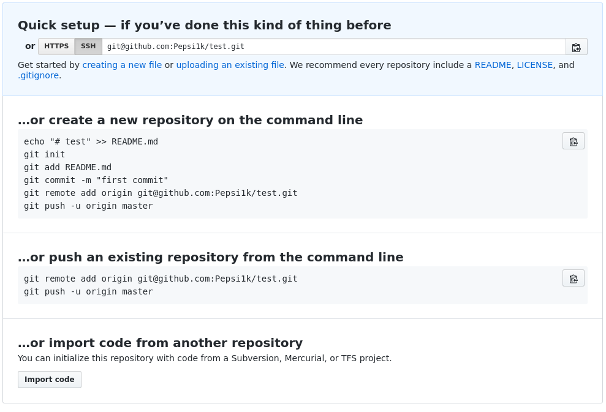
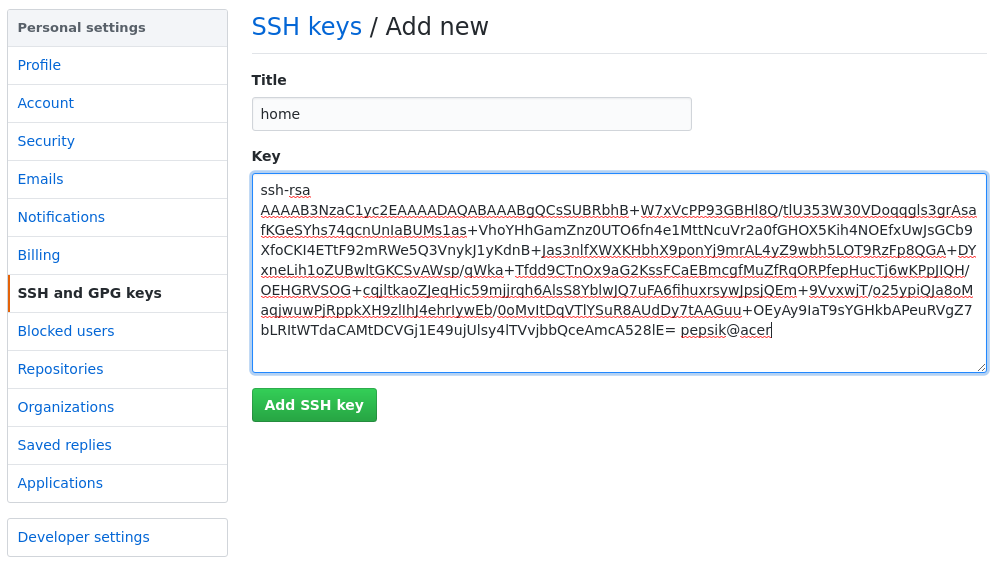

# github




Для того чтобы постоянно не вводить пароль, а иметь возможнось обращатся через **ssh**,
нужно сгенерировать ключи и добавить публичный ключ в github

```bash
ssh-keygen -t rsa -f ~/.ssh/id_rsa_github # генерируем 
cat ~/.ssh/id_rsa_github.pub | xclip -selection clip # копируем
```

Теперь вставим скопированый ключ в github


Последний штрих, настроим `~/.ssh/config` в этом конфиге прописываются пути к приватным ключам
```
host github.com
	HostName github.com
	IdentityFile ~/.ssh/id_rsa_github
	User git
```
