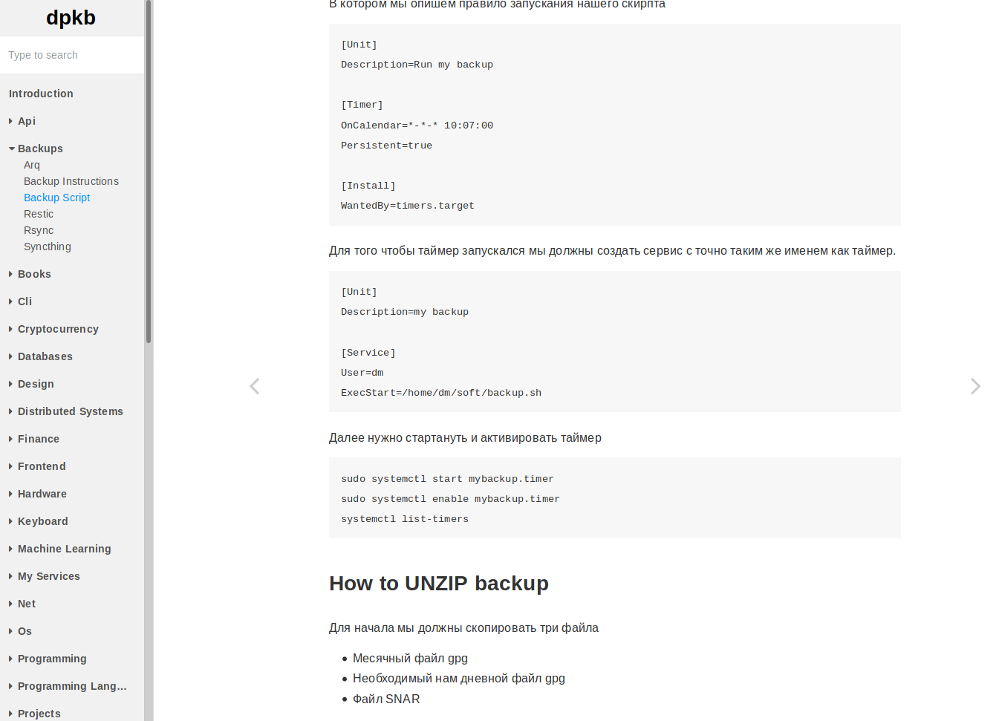
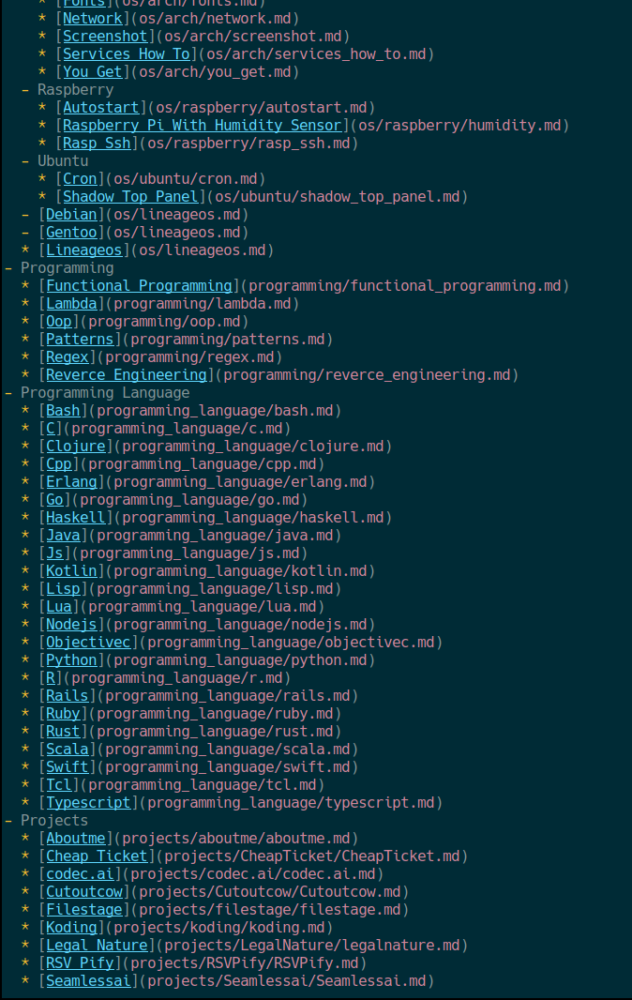
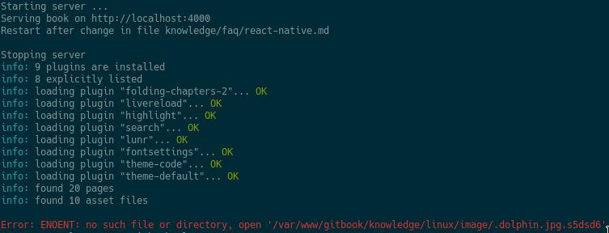

# Knowladge base


Статья: https://devpew.com/knowledgebase/

## GitBook
GitHub: https://github.com/GitbookIO/gitbook-cli

Это инструмент для ведение базы знаний.
Тут есть фолдинг, поиск и неплохое отображение кода.



Так же тут есть одна особенность. Тут нет автоманической генерации.
Если у других нужно складировать md-файлы в какой-то каталог и все происходит автоматически,
то тут есть файлик, который называется `SUMMARY.md` в нем описывается дерево файлов, которое будет отображаться слева.




#### Install

1. Скачиваем nodejs:
```bash
sudo pacman -S nodejs npm
node -v && npm -v
# v10.15.1
# 6.4.1
```
2. Создадим директорию:
```bash
sudo mkdir /var/www/gitbook
sudo chown -R pepsik/users /var/www/gitbook
cd /var/www/gitbook
```
3. Установим гитбук гобально:
```bash
npm install gitbook-cli -g
gitbook --version
# CLI version: 2.3.2
# GitBook version: 3.2.3
```

4. Установим его в текущую папку:
```bash
gitbook init
```
5. Теперь немного настроим его. Создаем файл book.json:
```bash
touch book.json
```
Со следуйщим содержимым:
```json
{
	"plugins": [
		"folding-chapters-2",
		"theme-code",
		"-sharing"
	],
	"pluginsConfig": {
		"theme-default": {
			"showLevel": false
		}
	}
}
```
Теперь их нужно установить:
```bash
gitbook install
```
6. Все сгенерировано. Теперь можем запускать нашу базу.
```bash
gitbook serve
```

#### Установка на удаленный сервер
Установка на сервер отличается установкой `nodejs` и `npm`. Дальше все тоже самое.
```bash
sudo apt update && sudo apt upgrade -y # обновим убунту
curl -sL https://deb.nodesource.com/setup_10.x | sudo -E bash -
sudo apt install -y nodejs 
sudo npm install -g npm@latest
```

Настроим синхронизацию
Значит понядобятся две программы `rsync` и `inotifywait`:
```bash
sudo pacman -S rsync # для самой синхронизации с сервером 
sudo pacman -S inotify-tools # для отслеживание измененией в локальной директории
```

Скрипт для синхронизации:
```bash
#!/bin/sh 
GITBOOK_DIR="/var/www/gitbook"
REMOTE_DIR="root@11.1.1.0:/var/www/gitbook"

# book - 
# upload - 
TITLE=""

while true 
do
	#book icon
	echo 
	inotifywait -e modify --format '%:e %f'  -r "$GITBOOK_DIR" \
		"@$GITBOOK_DIR/book1/" \
		"@$GITBOOK_DIR/_book/" &> /dev/null

	#upload icon
	echo "%{F#0A82F5}%{F-}"
	
	if [[ $? == 0 ]]; then
		rsync -r $GITBOOK_DIR/knowledge $REMOTE_DIR --delete &> /dev/null
		echo "%{F#76B9FA}%{F-}"
		rsync $GITBOOK_DIR/{README.md,SUMMARY.md,book.json} $REMOTE_DIR &> /dev/null
	fi
done

```

Config для `polybar`:
```vim
[module/gitbook_sync]
type = custom/script
exec = $HOME/.config/polybar/polybar-script/gitbook_sync.sh
tail = true
```

Запускать наш сервер нужно через `nohup`, так как при закрытии сессии может завиршиться процесс вызванный пользователем.
При этом нужно создать файл nohup.log, в него будет записываться вывод программы.
```bash
nohup gitbook serve &
```


При синхронизации возможна следующая ошибка
[gitbook-cli/issues#55](https://github.com/GitbookIO/gitbook-cli/issues/55)



Для её решение нужно в файле `~/.gitbook/version/3.2.3/lib/output/website/copyPluginAssets.j` удалить `confirm: true`, строка 112.
