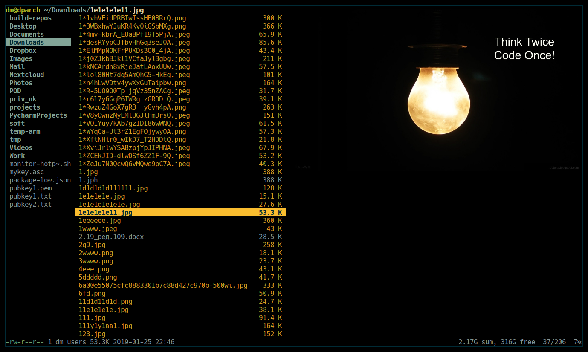
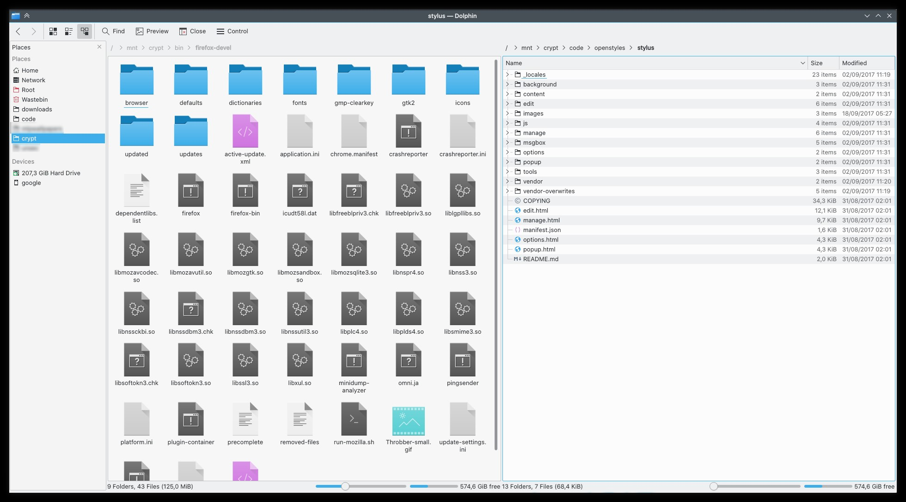

<dl> 
<style>
h2 {
border-bottom: 1px solid #eaecef;
padding-bottom: .3em;
}
</style>
</dl>

## Ranger

Вообще преимущества этого менеджера в том, что он очень работает в терминале, гибкий, 
легко настраивается и имеет хоткеи как у Vim.

* **Доп. информация:** http://zenway.ru/uploads/07_13/ranger.pdf
* **Devpew:** https://devpew.com/ranger/



Установка `pacman -S ranger`

#### Навигация
* `hjkl` - влево, вниз, вверх, вправо 
* `gg` - перейти в начало
* `G` - перейти в конец
* `a` - переименовать файл
* `/` - поиск
* `f` - поиск с переходом
* `i` - открыть файл с помощью просмотрщика
* `r` - открыть мень *открыть с помощью*
* `zh` - покажет скрытые файлы
* `yy` - как в vim скопирует
* `dd` - вырежет
* `pp` - вставит
* `q`- выход
* `?` - help

#### Вкладки
* `Ctrl+N` - создать новую вкладку
* `Ctrl+W` - закрыть текущую
* `Tab` - перейти на следующую вкладку
* `Shift+Tab` - перейти на предыдущую

#### Shell

`Shift+s` - открыть shell в текущей директории

Так же можно выполнить любую команду Ranger-a шелла через `:`
И обычную команду через `!`

Отличиются режимы тем, что через `:` запускаются именно функции Ranger, 
например в Ranger есть своя функция chmod и если мы напишем `:chmod +x 1.sh` то нам выдаст ошибку, так как там другой синтаксис. 

Но если введем `!chmod +x 1.sh` то все будет нормально, так как выполнится стандартная шеловская команда `chmod`

Мы так же можем не писать имя если выполняем команду для выделенного файла.
Можем сделать просто `!chmod +x %f` или мы можем выбрать несколько файлов и сделать для них для всех `!chmod +x %s`

#### Сортировка
* `ob` - по имени
* `om` - по времени создания файла
* `oc` - по времени изменения
* `ot` - по типу
* `oe` - по расширению

#### Конфигурирование
Для добавления в ranger изменений в функции работы, или изменение каких-то параметров необходимо 
скопировать конфиги в домашний каталог командой (в shell) `ranger —copy-config=all`.

`rc.conf` - находятся все ваши горячие клавиши и то, что загружается вместе с ranger

`commands.py` - в котором будут все ваши кастомные функции запускаемые через `:`

`rifle.conf` - в котором вы определяете какой тип файла какой программой открывать

`scope.sh` - скрипт, чия задача определение типов файлов

#### Отображение картинок
**Image Previews:** https://github.com/ranger/ranger/wiki/Image-Previews

1. Устанавливаем пакет w3m для Arch Linux, w3m-img для Debian и Fedora
2. Добавляем в наш `~/.config/ranger/rc.conf`:
```bash
set preview_images true
set preview_images_method urxvt
```

#### Default text editor
Поумолчанию ranger будет открывать файлы спомощью редактора который записан в глобальных переменных **VISUAL**, **EDITOR**.
Поэтому в файле `/etc/profile` мы обьявим эти две переменные.
```bash
export TERMINAL
VISUAL=nvim
export VISUAL
EDITOR=nvim
export EDITOR 
```

## Dolphin

Этот файловый менеджер имеет красивый графический интерфейс.



Установка `sudo pacman -S dolphin`

