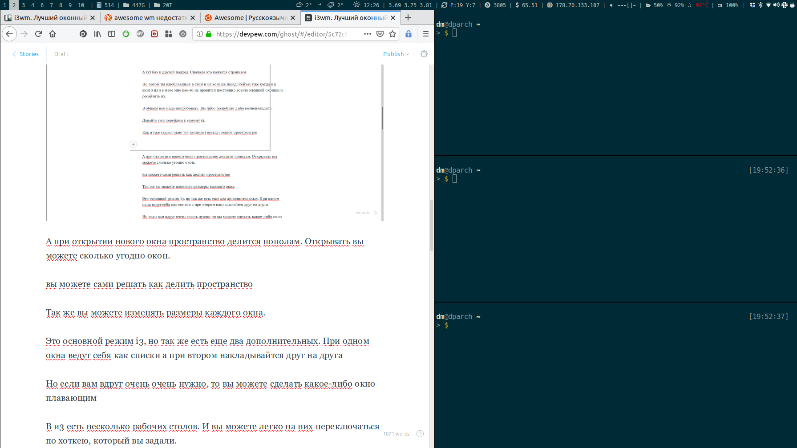

# Установка i3



**i3** - это динамический тайловый оконный менеджер.

Сначало нужно установить xorg-server:
```console
pacman -S xorg-server
```

Установка i3:
```console
pacman -S i3
```

Для начала нужно создать пользователя, под которым мы будем работать:
```console
useradd -m -g users -G audio,lp,optical,power,scanner,storage,video,wheel -s /bin/bash pepsik
```

Теперь нужно сделать пароль для пользователя:
```console
passwd pepsik
```

Можно проверить созданного пользователя, выйдя спомощью **exit**.

Дальше нужно настроить **sudo** для нашего пользователя:
```console
pacman -S sudo
```

И для того, чтобы наш пользователь мог её использовать нужно разкоментировать ***%wheel ALL=(ALL) ALL***, в файле ***/etc/sudoers***.

Теперь, заходим на нашего пользователя *pepsik* и создаем файл ***/home/pepsik/.xinitrc*** дописываем туда ***exec i3***.

Далее, нужно установить xorg-xinit:
```console
sudo pacman -S xorg-xinit
```

Теперь можно запускать i3:
```console
startx
```


## Необходимость закрыть i3

Если есть необходимость закрыть i3, можно через *Alt+Ctrl+F2* изменить tty.
Дальше спомощью команды **w** узнаем номер tty:
```console
w
```
Находим запущенные процессы на выбранном tty:
```console
ps -ft tty1
```
Находим pid запущенного i3 и останавливаем его:
```console
kill -9 1349 
```

## Возможные ошибки

Если на экране будут артефакты, или очень маленькое окошко:
```console
sudo pacman -S ttf-dejavu
```

ERROR: *i3-sensible-terminal could not find a terminal emulator. Please install one.*, нужно установить **xterm**:
```console
sudo pacman -S xterm
```

ERROR: *status_command not found or is missing a library dependency (exit 127)*. Нужно установить i3-status.
Вводим команду ниже только теперь выбираем i3-status(5):
```console 
sudo pacman -S i3
```

## Set wallpaper
i3 не умеет устанавливать обои, поэтому нам понадобится `feh`
```bash
sudo pacman -S feh
```

Теперь настроим наш `~/.config/i3/config`:
```bash
exec --no-startup-id feh --bg-scale $HOME/.config/i3/firewatch-wallpapers.jpg
```
