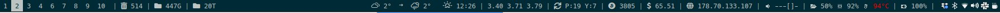
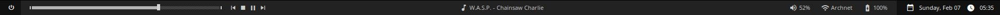

# Установка polybar





## Обычная установка 
Перед установкой [polybar](https://github.com/polybar/polybar/#dependencies), сначала нужно установить [build dependencies](https://github.com/polybar/polybar/wiki/Compiling):
```console
sudo pacman -S gcc git cmake python-sphinx
```
> **Note:** You only need either **gcc** or **clang**.

После установки, можно удалить build dependencies:
```console
sudo pacman -R gcc git cmake python-sphinx
```

Это важные зависимости, без них не будет работать polybar:
```console
sudo pacman -S cairo libxcb xcb-proto xcb-util-image xcb-util-wm
```

Скачавием репозиторий:
```console
git clone --recursive https://github.com/polybar/polybar
cd polybar
```

Компилируем его:
```console
mkdir build
cd build
cmake ..
make -j$(nproc)
sudo make install
```

## Установка спомощью AUR
```bash
git clone https://aur.archlinux.org/polybar.gi://aur.archlinux.org/polybar.git 
cd polybar/
makepgk -sir
``` 

## Настройка
Создаем конфигурационные файлы:
```console
make userconfig
```

Теперь можем проверить polybar:
```console
polybar example
```

## Шрифты 

Для настройки Font Awesome, нужно:
* [Font-Awesome](https://fontawesome.com/)
* [rofi](./rofi.md)
* [xclip](https://github.com/astrand/xclip) 
* [rofi-fontawesome](https://github.com/wstam88/rofi-fontawesome)

#### Font-Awesome
1. Скачиваем *desktop* шрифты c [GitHub](https://github.com/FortAwesome/Font-Awesome), ***FortAwesome/Font-Awesome->Release***
2. Создаем папку `~/.local/share/fonts` или `~/.fonts`
3. Копируем в неё директорию `fontawesome-free-5.9.0-desktop`

#### xclip
1. Установка:
```bash
git clone https://github.com/astrand/xclip # clone repository
cd xclip/                # move to xclip
autoreconf               # create configuration files
./configure              # create the Makefile
make                     # build the binary
sudo make install        # install xclip
sudo make install.man    # install man page
```
2. Настройка `.vimrc` [copy/paste with xclip](https://vim.fandom.com/wiki/GNU/Linux_clipboard_copy/paste_with_xclip):
```bash
vmap <F6> :!xclip -f -sel clip<CR>
map <F7> :-1r !xclip -o -sel clip<CR>
```

#### rofi-fontawesome
**rofi-fontawesome** - читает с файла `fa5-icon-list.txt` иконки и выводит их в **rofi**.

1. Установка:
```bash
git clone https://github.com/wstam88/rofi-fontawesome
cd rofi-fontawesome/fontawesome-menu
```
2. Команды:
```bash
./fontawesome-menu -about           # справка 
./fontawesome-menu                  # если файл находится тамже где и скрипт
fontawesome-menu -o '-i -columns 4' # выводит иконки в 4 столбца
fontawesome-menu -f path/to/fa5-icon-list.txt
``` 
