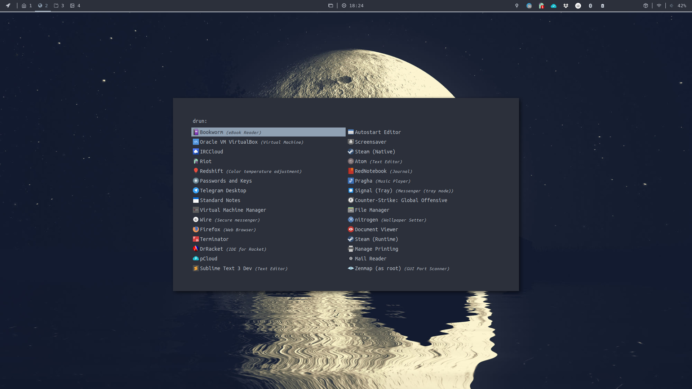
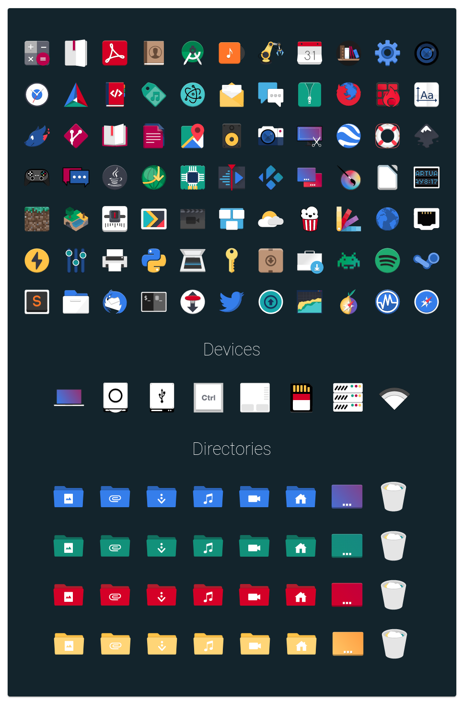

# rofi

**rofi** - программа для поиска и запуска приложений.



* **Arch wiki:** https://wiki.archlinux.org/index.php/Rofi
* **GitHub:** https://github.com/davatorium/rofi


## Установка
```bash
sudo pacman -S rofi
```


## Запуск
Для запуска различных утилит:
```console
rofi -show run
```
Запуск приложений:
```console
rofi -show dmenu
```


## Настройка
Конфигурации программы находятся в ***~/.config/rofi/config***. 
В нем используется Xresources формат.

Пример ***~/.config/rofi/config***:
```bash
rofi.modi:	drun
rofi.show-icons: true
rofi.icon-theme: Flat-Remix-Red-Dark
rofi.hide-scrollbar: true
rofi.separator-style: none
rofi.font: Hack 10

!{border-line1, text, border-line2, chose-border, chose-text} 
rofi.color-normal: #002B36, #BCC3C3, #002B36, #074B5D, #BCC3C3
!{window-background, window-border}
rofi.color-window: #002B36, #000000
!rofi.color-window: #002B36, #002B36

```
> Для параметра **icon.theme**, иконки должны быть в директории ***~/.icons*** или ***~/.locale/share/icons***

Также можно создать файл с разширением ****.rafi***, этот файл предназначен для настройки rofi используя css формат.

```css
configuration {
    drun-icon-theme:    "Paper";
    cycle:              true;
    hide-scrollbar:     true;
    disable-history:    true;
    modi:               "drun";
    show-icons:         true;
    display-drun:       "apps";
}
```

#### Установка Flat-Remix



**GitHub:** https://github.com/daniruiz/flat-remix

```console
git clone https://github.com/daniruiz/flat-remix &&
mkdir -p ~/.icons && cp -r flat-remix/Flat-Remix* ~/.icons/ &&
gsettings set org.gnome.desktop.interface icon-theme "Flat-Remix"
```


