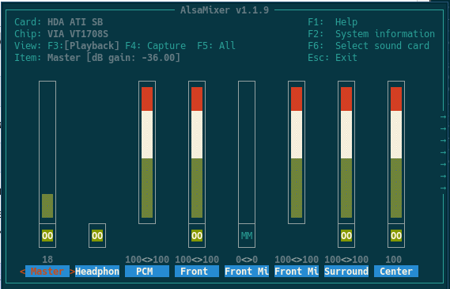

# Video 

```bash
sudo pacman -S mpv
```

Для того чтобы воспроизвести видео с youtube нужно скачать `youtube-dl`.
С помощью нее можно скачивать видео. А уже `mpv` воспроизводит это видео.
```bash
sudo pacman -S youtube-dl
```

Чтобы скачать музыку, нам нужно две опции:
* —extract-audio (короткая опция —x) — Преобразование видеофайлов в аудио-файлы.
* —audio-format — указывает аудиоформат, в котором будет загружен файл. Поддерживаемые аудиоформаты являются «best», «aac», «vorbis», «mp3», «m4a», «opus» или «wav»; «Best» установлен по умолчанию
```bash
youtube-dl -x --audio-format mp3 https://www.youtube.com/watch?v=xDhjma091uI
```

Также понадобится `xsel` для перенаправления буфера. 
```bash
sudo pacman -S xsel
```

Теперь чтобы открыть видео в 2 клика нужно добавить hotkey в `.config/i3`:
```bash
bindsym Ctrl+e exec mpv $(xsel -b)
```

# Настройка звука

Посмотрим на звуковую карту:
```bash
lspci | grep -i audio
```

Установим пакет `alsa-utils` из официального репозитория, который содержит `alsamixer` и `amixer`
```bash
pacman -S alsa-lib alsa-utils
```

В ALSA по умолчанию отключены все каналы, и они все должны быть включены вручную. Этого можно добиться при помощи amixer:
```bash
amixer sset Master unmute
```

Также можно сделать то же самое с `alsamixer`
```bash
alsamixer 
alsamixer -V capture # настройка микрофона
```

Configure hot keys at `~/.xbindkeysrc`:
```
"amixer set 'Master' 10%+"
   XF86AudioRaiseVolume
"amixer set 'Master' 10%-"
   XF86AudioLowerVolume
"amixer set 'Master' toggle"
   XF86AudioMute
"amixer set Capture toggle"
   XF86AudioMicMute
```



Проверка работы микрофона:
```bash
amixer set Capture cap # включение Capture
arecord test.wav # запись
aplay test.way # воспроизведение
arecord -f data -d hw:0,0 - | aplay -f data - # или все и сразу
```

> Возможно нужно будет ребутнуться для полной работы alsa.

### Лишние шумы c микрофона

Для того чтобы убрать лишние шумы, нужно будет поиграться с `pulseaudio`. Для начало установим нужные программы:
```bash
sudo pacman -S pulseaudio pulseaudio-alsa pavucontrol
# pulseaudio - сама утилита которая всем заправляет
# pulseaudio-alsa - нужно для совместимости с alsa
# pavucontrol - gui для настройки звука, может и не понадобится
```

Узнаем номер звуковой карты: 

```bash
arecord -l
# **** List of CAPTURE Hardware Devices ****
# card 0: SB [HDA ATI SB], device 0: VT1708S Analog [VT1708S Analog]
#   Subdevices: 1/1
#   Subdevice #0: subdevice #0
```
В данном случае **hw:0,0**.

Немного изменим конфиг в `/etc/pulse/default.pa`
```bash
load-module module-alsa-sink # возможно не нужно будет трогать 
load-module module-alsa-source device=hw:0,0 # заменим на наш номер звуковой карты
```
* **sink** - для вывода
* **source** - для микрофона

Теперь, путем подбора, найдем подходящую частоту дискретизации для нашей звуковой карты.
```bash
arecord -f dat -r 60000 -D hw:0,0 -d 5 test.wav # записываем 60000 - дискретная частота
aplay test.wav # проигрываем test.wav # если все ок, то идем дальше 
```


