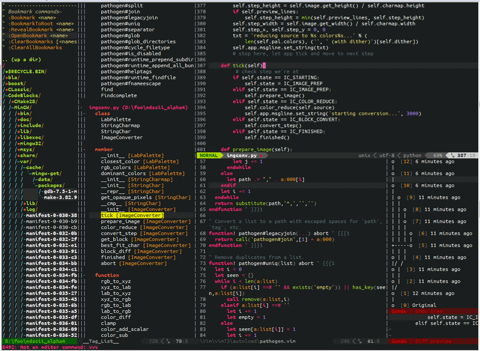

# Vim 




Установка:
```bash
sudo pacman -S vim
```


# Neovim

1. Скачиваем neovim:
```bash
sudo pacman -S neovim
```
* Скачиваем дополнительный модуль:
```bash
sudo pacman -S python-neovim
```
* Скачиваем менеджер плагинов **vim-plug**:
```bash
curl -fLo ~/.local/share/nvim/site/autoload/plug.vim --create-dirs https://raw.githubusercontent.com/junegunn/vim-plug/master/plug.vim
```
* Создаем файл ***~/.config/nvim/init.vim***, и записываем туда начальный конфиг:
```vim
call plug#begin('~/.vim/plugged')
Plug 'scrooloose/nerdtree', { 'on':  'NERDTreeToggle' }
call plug#end()
set tabstop=4
set shiftwidth=4
set softtabstop=4
set smarttab
set smartindent
"set timeout ttimeoutlen=100
"set autoindent
set number
set hlsearch
set incsearch
set mouse=a
set ruler
set laststatus=0
set clipboard=unnamed
set linebreak
set bs=indent,eol,start
set completeopt=longest,menuone
set nolist listchars=tab:\|\ ,trail:·
```

* Добаляем alias в ***~/.bashrc***:
```bash
alias v='nvim'
```

## Русский язык
Для начала нужно скачать библиотеку `libxkbswitch.so` в которой потдерживается интерфейс `libcall()`. Эта библиотека находится в `xkb-switch`.
* **GitHub**: https://github.com/ierton/xkb-switch
* **AUR**: https://aur.archlinux.org/packages/xkb-switch-git/

Xkb-switch goes with a library libxkbswitch.so which can be called from within Vim scripts like this:
```vim
let g:XkbSwitchLib = "/path/to/libxkbswitch.so"
echo libcall(g:XkbSwitchLib, 'Xkb_Switch_getXkbLayout', '')
call libcall(g:XkbSwitchLib, 'Xkb_Switch_setXkbLayout', 'us')
```

Следуйщий скрипт при нажатии **Esc** запоминает какой язык использывался в ***INSERT-mode***,
переключает *layout* на *us(us)*, а при заходе в ***INSERT-mode*** переключает *layout* тот который был в ***INSERT-mode***.
```vim
let g:XkbSwitchLib = "/usr/lib/libxkbswitch.so"
let g:current_lang = libcall(g:XkbSwitchLib, 'Xkb_Switch_getXkbLayout', '')
let g:prev_lang = g:current_lang

function Leave()
	let g:prev_lang = libcall(g:XkbSwitchLib, 'Xkb_Switch_getXkbLayout', '')
	call libcall(g:XkbSwitchLib, 'Xkb_Switch_setXkbLayout', 'us')
endfunction

autocmd InsertEnter * call libcall(g:XkbSwitchLib, 'Xkb_Switch_setXkbLayout', g:prev_lang)
autocmd InsertLeave * call Leave()
```

