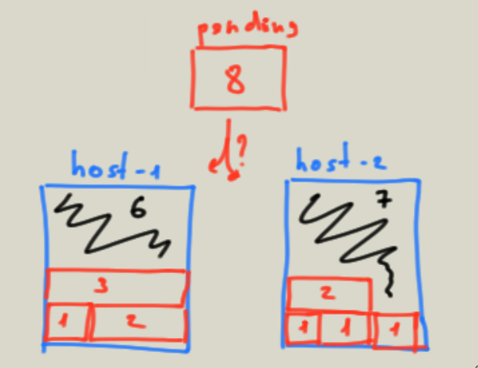

Хоть kubernetes и смотрит за ресурсами хоста, и равномерно распределяет поды, желательно описывать [affinity](https://kubernetes.io/docs/concepts/scheduling-eviction/assign-pod-node/) на какой пул хостов может сесть тот или иной pod.

Иначе может выйти ситуация при которой небольшие поды наполовину заняли ресурсы двух хостов и уже прожорливый под не может найти себе место.

