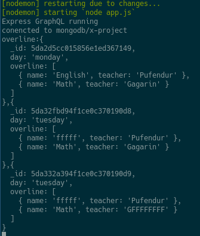
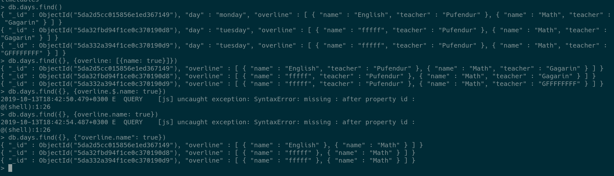
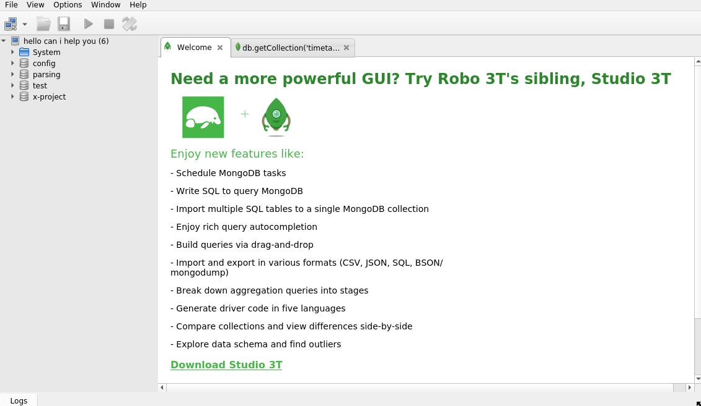
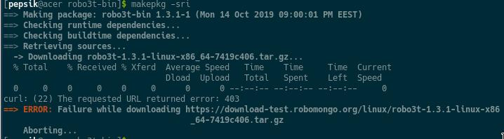
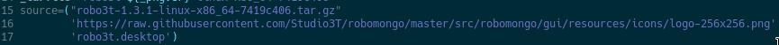

<dl> 
<style>
h2 {
border-bottom: 1px solid #eaecef;
padding-bottom: .3em;
}
</style>
</dl>


## Headers

* [My experements](#my-experements)
* [LB 1: Start](#lb-1:-start)
* [LB 2: GRUD commands](#lb-2:-crud-commands)
* [LB 3: Install Robo 3T](#lb-3:-install-robo-3t)

## Backup DB
```bash
# create backup of x_project_test db and save to folder with the current date
mongodump --db=x_project_test --out=./x_project_test-$(date +"%d-%m-%Y")
mongorestore --drop --db=x_project_test x_project_test/
```

## My experements
```bash
mongoimport --db <db-name> --collection <coll-name> --type json --file seed.json
mongoexport --collection=events --db=reporting --out=events.json
```



javascript + mongoose: 
```js
day.find({ "overline.teacher": "Gagarin" }, function(err, res) {
	if (err) return console.log(err);
	console.log("overline:" + res);
})
```

mongoShell: 
```js
//удалит все поля _id в массиве overline
db.days.updateMany({}, {$unset: {"overline.$[]._id": ""}})
//добавит новый обьект в массив overline
db.days.update({day: "wednesday"}, {$push: {overline: null}})


//удалить все поля где buildingNumber != 1
db.classRooms.remove({buildingNumber: {$ne: 1}})

```





## LB 1: Start
#### Install MongoDB to Ubuntu
https://docs.mongodb.com/manual/tutorial/install-mongodb-on-ubuntu/

```bash
wget -qO - https://www.mongodb.org/static/pgp/server-4.2.asc | sudo apt-key add -
echo "deb [ arch=amd64 ] https://repo.mongodb.org/apt/ubuntu bionic/mongodb-org/4.2 multiverse" | sudo tee /etc/apt/sources.list.d/mongodb-org-4.2.list
sudo apt-get update
sudo apt-get install -y mongodb-org

# что-то непонятное
echo "mongodb-org hold" | sudo dpkg --set-selections
echo "mongodb-org-server hold" | sudo dpkg --set-selections
echo "mongodb-org-shell hold" | sudo dpkg --set-selections
echo "mongodb-org-mongos hold" | sudo dpkg --set-selections
echo "mongodb-org-tools hold" | sudo dpkg --set-selections
```

#### Run MongoDB 
```bash
sudo systemctl start mongod # запускаем демона монго
sudo systemctl enable mongod # чтобы при запуске машины стартовала монго
systemctl status monod # статус
```

Для начало запустим клиент `mongo`, он свяжится с сервиром на котором мы сможем выполнять команды:
```bash
use test # нужно указать какую БД мы будем использывать, если её нет она создастся
db.users.save( { id: "1", name: "Nikolaev" } ) # тут мы в колекцию users добавили документ 
```


> _id: ObjectId(4 bytes timestamp, 3 bytes machine id, 2 bytes process id, 3 bytes incrementer)

Конфиг поумолчанию хранится в `/etc/mongodb.conf`. Немного про конфиг:

```bash
# Where and how to store data.
storage:
  dbPath: /var/lib/mongodb # путь к БД монго 
  journal: # в директории `$dbPath/journal` ведется журналирование, оно нужно для того чтобы **WiredTiger** смог использывать checkpoints
    enabled: true

# where to write logging data.
systemLog:
  destination: file
  logAppend: true
  path: /var/log/mongodb/mongod.log # путь к лога файлу

# network interfaces
net:
  port: 27017 # порт по умолчанию
  bindIp: 127.0.0.1 # адресс localhost


# how the process runs
processManagement:
  timeZoneInfo: /usr/share/zoneinfo

```


## LB 2: CRUD commands

```bash
#task 1
sudo systemctl start mongod # запускаем mongo
show dbs 
show collections
use proba
db.dropDatabase()

#task 2
use test
db.books.insert( {"type": "book", "name": "Букварь"} )
db.books.find()

var tempDoc = {"type": "book", "name": "Азбука"}
db.books.insert(tempDoc)
tempDoc = {"type": "tutorial", "name": "Computer networks"}
tempDoc.year = 2015
db.books.insert(tempDoc)
db.books.find({"type": "book"}).sort({"name": 1}) # сортировка по возврастанию
db.books.find({"type": "book"}).sort({"name": -1}) # сортировка по убыванию

#task 3
db.books.findOne() # выводит первый документ
a = db.books.findOne({"name": "Букварь"})
a.year = 1963
db.books.save(a) # добавит новый документ или добавит новое поле
db.books.find()
db.books.update({"name": "Букварь"}, {"year": 1984}) # польностью заменяет документ
db.books.insert({"name": "Букварь", "year": 1982, "type": "book"})
db.books.insert({"name": "Рассказы", "year": 1985, "type": "book"})
db.books.remove({"type": "book"}) # удаляет документы с полями { type: "book" }
db.books.remove({}) # удаляет все поля
```

## LB 3: Install Robo 3T



* **Official site:** https://robomongo.org
* **AUR:** https://aur.archlinux.org/packages/robo3t-bin/

Install with aur: 
```bash
git clone https://aur.archlinux.org/robo3t-bin.git
cd robo3t-bin
makepkg -sri
```


**ERROR:** If you have an error like shown below. 



You have to download the source from official site and add path to `PKGBUILD` in `source=()` option.


