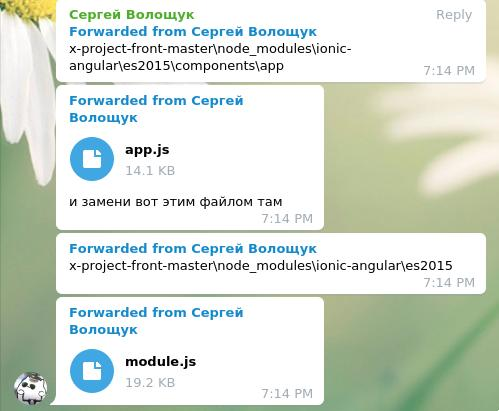

#### Run ionic: 
клонируем репу по ssh: 
```bash
git clone git@gitlab.com:FominSerhii/x-project-front.git
```

Теперь нужно заменть app.js и module.js



```bash
npm install -g ionic
npm install 
ionic serve
```

#### MongoDB
Insert **studentsTimetable**: 
```js

db.classRooms.insert([
{
    "_id" : ObjectId("5da605712dceb6e5b7f3d686"),
    "buildingNumber" : 1,
    "classNumber" : 404
},
{
    "_id" : ObjectId("5da660c9276518144ffcfbcb"),
    "buildingNumber" : 2,
    "classNumber" : 101
},
{
    "_id" : ObjectId("5da660c9276518144ffcfbcc"),
    "buildingNumber" : 3,
    "classNumber" : 202
},
{
    "_id" : ObjectId("5da660c9276518144ffcfbcd"),
    "buildingNumber" : 4,
    "classNumber" : 303
}
]);


db.studentTimetables.insert([
{
    "_id" : ObjectId("5da6698c276518144ffcfbce"),
    "courseID" : NumberInt(1),
    "groups" : [ 
        {
            "groupID" : NumberInt(101),
            "subgroups" : [ 
                {
                    "subgroupID" : "A",
                    "week" : [ 
                        {
                            "day" : "monday",
                            "overline" : [ 
                                {
                                    "subject" : "English",
                                    "teacher" : "Панелопа Пуфендуй",
                                    "classRoom" : {
                                        "buildingNumber" : NumberInt(1),
                                        "classNumber" : NumberInt(404)
                                    }
                                }
                            ],
                            "underline" : null
                        }
                    ]
                }
            ]
        }
    ]
},
{
    "_id" : ObjectId("5da66f33276518144ffcfbcf"),
    "courseID" : NumberInt(2),
    "groups" : [ 
        {
            "groupID" : NumberInt(101),
            "subgroups" : [ 
                {
                    "subgroupID" : "A",
                    "days" : [ 
                        {
                            "day" : "monday",
                            "overline" : [ 
                                {
                                    "subject" : "English",
                                    "teacher" : "Панелопа Пуфендуй",
                                    "classRoom" : {
                                        "buildingNumber" : NumberInt(1),
                                        "classNumber" : NumberInt(404)
                                    }
                                }, 
                                {
                                    "subject" : "Math",
                                    "teacher" : "Vanya",
                                    "classRoom" : {
                                        "buildingNumber" : NumberInt(2),
                                        "classNumber" : NumberInt(204)
                                    }
                                }
                            ],
                            "underline" : [ 
                                {
                                    "subject" : "Philosofy",
                                    "teacher" : "Philosofy Teacher",
                                    "classRoom" : {
                                        "buildingNumber" : NumberInt(1),
                                        "classNumber" : NumberInt(404)
                                    }
                                }, 
                                {
                                    "subject" : "Math",
                                    "teacher" : "Math Teacher",
                                    "classRoom" : {
                                        "buildingNumber" : NumberInt(3),
                                        "classNumber" : NumberInt(111)
                                    }
                                }
                            ]
                        }
                    ]
                }
            ]
        }
    ]
}
]);
```


**date_points**
```js
db.date_points.insertMany([
{
    "weekId": NumberInt(1),
    "weekState": NumberInt(1),
    "begin": new Date("2019-09-02"),
    "end": new Date("2019-09-08")
},
{
    "weekId": NumberInt(2),
    "weekState": NumberInt(2),
    "begin": new Date("2019-09-09"),
    "end": new Date("2019-09-15")
},
{
    "weekId": NumberInt(3),
    "weekState": NumberInt(1),
    "begin": new Date("2019-09-16"),
    "end": new Date("2019-09-22")
},
{
    "weekId": NumberInt(4),
    "weekState": NumberInt(2),
    "begin": new Date("2019-09-23"),
    "end": new Date("2019-09-29")
},
{
    "weekId": NumberInt(5),
    "weekState": NumberInt(1),
    "begin": new Date("2019-09-30"),
    "end": new Date("2019-10-06")
},
{
    "weekId": NumberInt(6),
    "weekState": NumberInt(2),
    "begin": new Date("2019-10-07"),
    "end": new Date("2019-10-13")
},
{
    "weekId": NumberInt(7),
    "weekState": NumberInt(1),
    "begin": new Date("2019-10-14"),
    "end": new Date("2019-10-20")
},
{
    "weekId": NumberInt(8),
    "weekState": NumberInt(2),
    "begin": new Date("2019-10-21"),
    "end": new Date("2019-10-27")
},
{
    "weekId": NumberInt(9),
    "weekState": NumberInt(1),
    "begin": new Date("2019-10-28"),
    "end": new Date("2019-11-03")
},
{
    "weekId": NumberInt(10),
    "weekState": NumberInt(2),
    "begin": new Date("2019-11-04"),
    "end": new Date("2019-11-10")
},
{
    "weekId": NumberInt(11),
    "weekState": NumberInt(1),
    "begin": new Date("2019-11-11"),
    "end": new Date("2019-11-17")
},
{
    "weekId": NumberInt(12),
    "weekState": NumberInt(2),
    "begin": new Date("2019-11-18"),
    "end": new Date("2019-11-24")
},
{
    "weekId": NumberInt(13),
    "weekState": NumberInt(1),
    "begin": new Date("2019-11-25"),
    "end": new Date("2019-12-01")
},
{
    "weekId": NumberInt(14),
    "weekState": NumberInt(2),
    "begin": new Date("2019-12-02"),
    "end": new Date("2019-12-08")
},
{
    "weekId": NumberInt(15),
    "weekState": NumberInt(1),
    "begin": new Date("2019-12-09"),
    "end": new Date("2019-12-15")
},
{
    "weekId": NumberInt(16),
    "weekState": NumberInt(3),
    "begin": new Date("2019-12-16"),
    "end": new Date("2019-12-22")
},
{
    "weekId": NumberInt(17),
    "weekState": NumberInt(3),
    "begin": new Date("2019-12-23"),
    "end": new Date("2019-12-29")
},
{
    "weekId": NumberInt(18),
    "weekState": NumberInt(4),
    "begin": new Date("2019-12-30"),
    "end": new Date("2019-01-12")
}
]);
```


